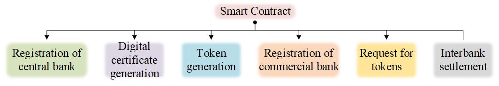
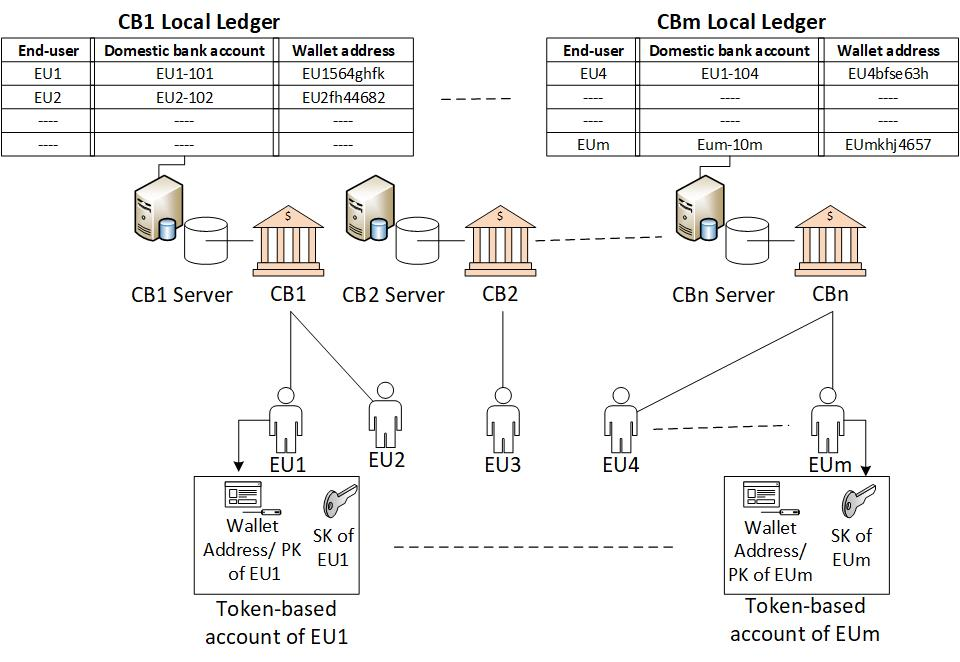
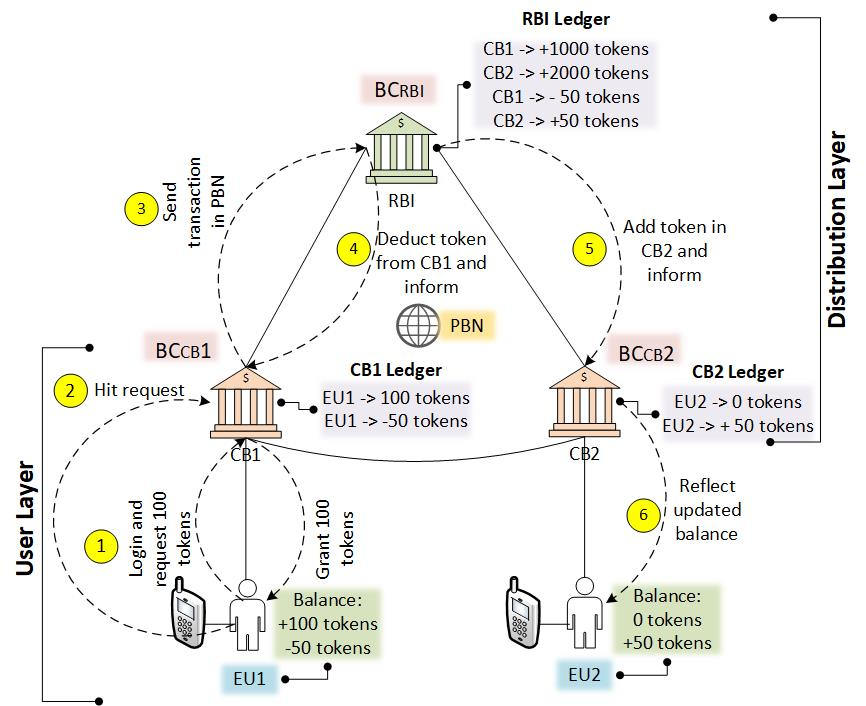

# Permission Blockchain Network based Central Bank Digital Currency
## Abstract
The central bank digital currency (CBDC) is gaining popularity for the last few years in many countries as it will affect the entire ecosystem of the current financial infrastructure. The CBDC utilizes digital tokens to indicate any nation’s fiat/stable currency that manages under distributed ledger technology such as blockchain. Compared to existing cryptocurrencies, the CBDC is regulated by the government monetary policies, including the issuance of digital tokens (i.e., digitized central bank money) and circulation of these digital tokens to the commercial banks, then to the public/end-users. This paper proposes a two-layered CBDC architecture after analyzing the recent research and existing CBDC pilot projects. The distribution layer shows wholesale CBDC based on permission blockchain network (PBN) between the central bank and the commercial banks. While, the user layer describes the functioning of retail CBDC, which shows the interaction between the commercial banks and the end-users through the token-based account. We aim to provide the CBDC design architecture and smart-contract functions for PBN.
## I. INTRODUCTION
*The popularity of cryptocurrencies such as Bitcoin [1], Ethereum [2], XRP [3], etc., is gaining attention and speeding up their circulation worldwide. These cryptocurrencies are not regulated by any centralized authority (i.e., government) also not considered as legal tender, which could lead to the support for anti-money laundering (AML), financing of terrorism (CFT), and other criminal activities. In particular, several countries are afraid of these illegal cryptocurrency circulations and planning to implement their legal digital money called central bank digital currency (CBDC). The CBDC uses digital tokens generated by converting any nation’s fiat/stable currency into digital tokens using distributed ledger technology (DLT) [4]. Unlike other cryptocurrencies, these digital tokens are generated by the nation’s monetary authority and issued and regulated under the central bank’s governance. Therefore, these digital tokens are pegged by a suitable amount of monetary assets such as gold or foreign currency reserves. The adoption of DLT in CBDC improves the current financial infrastructure by building trust in the issuance and circulation of digital tokens. The DLT enhances CBDC through fast and efficient processing of digital tokens, introduces transparency for validation of digital tokens, and makes overall CBDC architecture safer and inexpensive. The DLT records all the transactions in its immutable ledger, ensuring integrity, trust, and robustness in the CBDC network [5]. The bringing of CBDC in any nation may address current financial infrastructure vulnerabilities and inefficiencies by introducing decentralized monetary policies, a distributed secure payment system, reducing counterparty risks, stabilizing the financial payment market, etc.*
*There exist two types of CBDCs such as wholesale CBDC and retail CBDC. The wholesale CBDC is for the authorized financial institutions that carry reserve deposits with the central bank [6]. A wholesale CBDC is issued, distributed, managed, and stored entirely by the central bank or by an authorized institution appointed by the central bank to perform such tasks. The entities involved in the wholesale CBDC are not anonymous because they pre-register themselves under the central bank to access and conduct interbank payment settlement transactions processed by the central bank or through the authorized institution. The benefit of bringing wholesale CBDC in place of the traditional wholesale market is enhancing security and payment settlement efficiency, enabling real-time monitoring, minimizing counterparty credits and liquidity risk. On the other side, the retail CBDC is issued for the general public to purchase goods and services and send/receive digital tokens for fulfilling their routine demands [7]. The idea of retail CBDC is to promote a cashless society to reduce cash printing costs and make payments outside of the banking system, similar to cash payment [8].*
*In CBDC, the end-users can access the digital tokens using an account-based CBDC or token-based CBDC [9], [10]. In account-based CBDC, the end-user opens an account with the third-party provider authorized by the central bank. Hence, the third-party provider is responsible for end-user identity verification, know-your-customer (KYC) process, digital tokens distribution from one account to another, and transaction’s approval, e.g., commercial bank accounts. In token-based CBDC, an end-user requires a digital wallet to hold digital tokens accessed by a public/private key pair or digital signature. Therefore, the third-party provider approved the transaction based on the public/private key of the end-user. Also, a token-based CBDC may incorporate end-users identity to remove anonymity from the CBDC network, e.g., cash and crypto coins (i.e., bitcoin, ether, etc.).*
*At present, several countries are focusing on the research and development of CBDC. The People Bank of China was the first central bank and started researching CBDC in 2014, which later established a digital currency research institute in 2017 [11], [12]. The Bank of China’s CBDC project is called DC/EP (digital currency electronic payment), which addresses the wholesale and retail sector by developing digital Yuan. The Bank of England initiated its research into the CBDC project called RSCoin in 2015, which focuses on retail payments [13]. The Bank of Canada has actively researched CBDC since 2016 and proposed a CBDC project called Jasper, which aims to explore the possibility of creating a payment system for wholesale by issuing the Canadian digital dollar named CADCoin [14]. The Bank of Bahamas released its public document on CBDC in 2017 with the CBDC project name Sand Dollar and selected exuma island to experiment with the digital Bahamian dollar in the retail and wholesale domain [15].*
*Similarly, the countries collaborate on joint CBDC projects such as project Stella, Ubin, LionRock, etc., [16] to explore cross-border payments opportunities. So far, the Reserve Bank of India (RBI) has also started investigating CBDC opportunities and challenges in India and published a report on currency and finance 2020-21 [17]. RBI focuses on CBDC design’s benefit by promoting non-anonymity at the end-user level, monitoring financial transactions, pumping the central bank helicopter money, and supporting financial inclusion by direct transfer to increase social welfare. On the downside, the central bank pegged digital money may pose a possibility of disintermediation of the banking system. The RBI mentions a possible solution to overcome this problem by establishing a two-tier remuneration system for CBDC, lacking a design description.*
*In this paper, we propose a CBDC model using blockchain technology. We did a thorough study on the existing CBDC projects and introduced a two-layered model, explaining wholesale and retail CBDC. Further, we take an interbank settlement example to illustrate the back-end functionality for domestic payments and transfers using our proposed system model.  The rest of the paper is organized as follows. The related work is discussed in section II. CBDC overview and related technology are briefly outlined in Section III. In section IV, the proposed CBDC architecture is presented. Finally, concluding remarks and future work is given in Section V.*
## II. RELATED WORK ##
*In the paper [18], the author proposes a two-tier CBDC model for distributing digital currency in a wholesale DLT network. This digital currency is widely available for the general public using accounts provided by commercial banks. The disadvantage is that the author’s concept is valid for the small pilot project not acceptable at the country level. In the paper [19], the author designs a CBDC model using the permission blockchain called MBDC. For improving the scalability and payment process, the multi-blockchain architecture and Chain ID are utilized in the MBDC to distinguish between commercial banks and their sub-branches with the drawback of processing overhead due to the multi-blockchain layer. In the paper [20], the author proposes a CBDC model named Panda based on the dual blockchain system to maintain transaction data and account history separately with an efficient consensus protocol (i.e., BFT). They are also ensuring that only authorized parties have access to view the blockchain data. Perhaps running more than two blockchains simultaneously on the same network could lead to scalability problems and require high maintenance. In the paper [21], the author proposed a three-layer blockchain-based framework for CBDC to describe the entire lifecycle of CBDC from issuance to withdrawal of digital currency with an example of cross-border payment to describe the transaction payment and settlement through CBDC. In the paper [22], the author proposed the working of retail CBDC using token-based CBDC without DLT and focuses on many aspects such as digital signatures, blind signatures, key-exchange protocol to protect against AML/ CFL attacks and to bring anonymity during the transaction. Overall, most of the authors fulfill their work objectives in their terms and conditions, with a lack of issues. In this context, we present a two-layered CBDC framework after analyzing the existing research work.*
## III. BACKGROUND ##
### A.) CBDC Architecture ###
*The CBDC architecture follows one of the available two implementation approaches: direct CBDC and indirect CBDC.* 
### a.)	Direct CBDC
*In direct CBDC design, the central bank operates the digital tokens payment system and offers retail services to the end-users. Therefore, it is also called single-layered architecture. Any end-user can open an account in the central bank to receive digital tokens, as illustrated in Fig. 1. The central bank itself maintains the ledger of all accounts and executes retail payments. Therefore, it has complete control over the issuance and circulation of digital tokens. On the other side, the disadvantage of having this model is the tremendous workload. The central bank needs to provide good services to individuals and implement government regulations to prevent AML and anti-fraud prevention on all accounts.*
 
```
Figure 1: Direct Central Bank Digital Currency
```
### b.)	Indirect CBDC
*In the indirect CBDC model, the central bank creates and holds digital tokens. Still, intermediaries include commercial banks, are in charge of distributing these digital tokens, managing accounts and retail services for the end-users, as represented in Fig. 2. This model is similar to the current payment system and is sometimes known as the two-layered/intermediary model. The main difference is commercial banks request digital tokens from the central bank instead of end-users. This central bank manages the commercial bank’s account in its ledger to identify the digital tokens in circulation. The advantage of having this model is that it reduces the central bank load, encourages intermediaries to improve services for their customers, easy tracking of AML, fraudulent activities, etc.*
 
```
Figure 2: Indirect Central Bank Digital Currency
```
### B.)	Distributed Ledger Technology (DLT) ###
*Over the last few years, the financial sector has started exploring the DLT or blockchain to overcome existing financial sector challenges by leveraging greater transparency and improving the efficiency of clearing and settlement. The blockchain is an immutable database that continuously grows, replicates, and synchronizes among the blockchain nodes. Therefore, the blockchain nodes are responsible for achieving consensus over the shared transactions in the blockchain network, whether to add or reject the proposed transactions. There exist multiple consensus protocols such as proof of work, proof of stake, delegated proof of stake, practical byzantine fault tolerant, etc., [23] supported by either public or private blockchain. The public blockchain is open to everyone participating in the blockchain network, which is generally open-source and leveraged by the community. e.g., Bitcoin and Ethereum blockchain platforms. In comparison, the private blockchain is established, control and access only by the trusted or known entities. e.g., Hyperledger Fabric blockchain platform [24]. Any blockchain, either public or private, contains four core parts to enable blockchain functionalities. These are (a) block, (b) chain, (c) network, and (d) smart contract. The block is a collection of transactions with a time-stamp where the transaction contains any activity data such as money transfer between payer and payee. The chain represents the links between the new and previous blocks by interconnecting each other through a hashing algorithm. The blockchain’s network contains blockchain nodes that keep the entire record of all valid blocks. However, the smart contract is a program that indicates the multiple functions of any blockchain application stored on the blockchain network. This smart contract executes automatically by triggering an event on the blockchain network.*
### C.)	Facebook Diem Project ###
*Facebook started investigating CBDC with facebook libra project, later updated as the diem project. Since then, different countries start exploring this project to search for the possible opportunities of CBDC in their nation and came up with their revolutionary ideas and CBDC design to endure the existing financial sector. The libra association published its whitepaper [25], enabling a simple global payment system and financial infrastructure that empowers billions of end-users. The libra global payment system utilizes the libra blockchain, an open-source blockchain, and builds from scratch to target scalability, security, storage, and throughput issues. The libra blockchain started with libra byzantine fault tolerance (LibraBFT) protocol for achieving consensus, subsequently updated as DiemBFT. Later, facebook improved its existing libra project called libra 2.0, in which the diem association proposed change in four areas. First, instead of focusing on a single type of libra coin, libra plans to add several digital stable coins available in the libra network. Second, libra introduced enhance compliance procedures to protect against AML and to finance illicit activity. Third, pegged libra stable coins with a sovereign currency, and finally, the libra network transition from permissionless to permission.*
## IV.	PROPOSED FRAMEWORK FOR CBDC ##
*In this section, we present a two-layered CBDC framework considering the current financial infrastructure. The upper layer describes the wholesale CBDC through the distribution layer, whereas the lower layer specifies the retail CBDC using the user layer. Here, we focus on the design and working of CBDC, which is briefly described.*
### A.) Distributed Layer ###
*The distribution layer is a collection of the central bank, denoted by RBI and commercial banks indicated by, {〖CB〗_i } where i∈{1,…,n} as shown in Fig. 3. The central bank creates a permission blockchain network (PBN) which contains a central bank, commercial banks, and a certificate authority (CA). This PBN can be generated using existing blockchain frameworks such as Hyperledger Fabric, R3 Corda, etc., or the central bank may create its own customized PBN platform. Perhaps, the central bank remains the in-charge of publishing various smart contracts, including registration of central bank, digital certificate generation, tokens generation, registration of commercial bank, request for tokens, and interbank settlement in PBN at the distribution layer indicated in Fig. 4. The CA is the legitimate blockchain node, represented by 〖{BC〗_CA}. Further, it is responsible for issuing digital certificates (i.e., follow X.509 internet standards) to the central bank and the commercial banks in the PBN. This digital certificate binds the bank’s original identity (either central or commercial) and authenticates it while sending sign transactions in the PBN.*
 
```
Figure 3: Distributed Layer
```
*Initially, the central bank calls the register central bank smart contract and enters the essential data, which generates a token-based account for the central bank in PBN and returns a pair of public/private key, denoted by {〖PK〗_RBI,〖SK〗_RBI }  using public-key cryptography. The central bank interacts with CA through a digital certificate generation smart contract and sends a certificate signing request along with its 〖PK〗_RBI. The CA accepts the request and verifies whether the provided information is accurate. If so, the CA issues a digital certificate, denoted by {〖Cert〗_RBI }  to the central bank by signing the certificate using its private key. The central bank stores it’s〖 SK〗_RBI  in the hardware wallet to interact later with PBN. The central bank’s public key is used to derive the wallet address of the central bank using a hashing algorithm represented by {〖WA〗_RBI }. However, a blockchain node creates for the central bank at PBN, denoted by {〖BC〗_RBI }. Furthermore, the central bank calls a token generation smart contract to obtain the digital tokens of different denominations inside its wallet address, which indicates the central bank fiat currency in the form of digital money. These digital tokens may reserve by existing monetary assets (i.e., gold or foreign currency, etc.). Further, the central bank may issue new monetary policies to back these digital tokens with other commodities. The central bank invites the commercial banks to generate their token-based accounts to become legitimate nodes in PBN.*
*The commercial bank calls the registration of commercial bank smart contract and passes the necessary information to request a token-based account. The central bank receives the data and verify the provided details with its existing database (e.g., centralized RTGS server) and returns a public/private key pair, indicated by {〖PK〗_(〖CB〗_i ),〖SK〗_(〖CB〗_i ) }. The public key represents the wallet address, whereas the private key is placed in the hardware wallet, which is depicted by {〖WA〗_(〖CB〗_i ) }. This wallet address appears in the blockchain transactions while transferring and receiving digital tokens to and from the commercial banks and the central bank, and vice-versa. Like the central bank, the commercial bank invokes the digital certificate generation smart contract to request a digital certificate from CA. In return, the commercial bank receives a digital certificate, represented by {〖Cert〗_(〖CB〗_i ) }  and a valid blockchain node generated corresponding to the commercial bank, denoted by 〖{BC〗_(〖CB〗_i )} in PBN. The commercial bank invokes the request for tokens smart contract in PBN, where the commercial bank uses its secret key to sign the transaction and send a bundle of information in the transaction, including its digital certificate, the public key of the central bank, and wallet address of the central bank, indicated by Tx{〖〖〖WA〗_RBI (SK〗_(〖CB〗_i ) (PK〗_RBI (no.of tokens,〖Cert〗_(〖CB〗_i ))))}. The central bank decrypts the commercial bank’s received transaction and fetches the request tokens information and the commercial bank’s digital certificate. The central bank passes the commercial bank’s received digital certificate to the CA to verify commercial bank authenticity. If CA verifies, the central bank credit the no. of the requested digital tokens in the commercial bank’s wallet address. Further, release a sign transaction using its private key along with a digital certificate denoted by Tx{〖WA〗_(〖CB〗_i ) (〖SK〗_RBI (〖PK〗_(〖CB〗_i ) (credit no.of tokens ,Cert〗_RBI))} in PBN to indicate commercial bank requests achieve successfully. The commercial bank decodes the central bank transaction, retrieves the central bank's digital certificate, and forwards it to the CA to confirm the received tokens are original and are not double-spend. This transaction is store by various available blockchain nodes in their corresponding distributed ledger to maintain consistency and transparency in the PBN.*

 
```
Figure 4: Smart Contracts
```

### B.) User Layer ###
*The user layer’s key objective is to distribute the digital tokens to the end-users, received from the central bank to the commercial banks via PBN, which end-users can utilize in their day-to-day life, as shown in Fig. 5. The user layer is composed of the commercial banks and the end-users, indicated by {〖EU〗_j }  where j ∈{1,…,m}. Here, the central bank does not interact with end-users. Therefore, the central banks authorize the commercial banks for end-user’s KYC process. The commercial bank retains the data of spent digital tokens by end-users in its local ledger. The commercial banks provide the token-based account to the end-users by developing their own application or may use existing third-party software such as PayPal [26]. The end-user visits their commercial bank for the KYC process, if not previously done, and further requests a token-based account. The commercial bank instructs the end-user to download the application in their device and create a token-based account by filling in mandatory information in return, the commercial bank generates a pair of public/private key for the end-user, represented by 〖{PK〗_(〖EU〗_j ),〖SK〗_(〖EU〗_j )}. Here, the end user’s public key is used to create a wallet address to interact with the outer world, represented by {〖WA〗_(〖EU〗_j )}. After verification, the commercial bank uses the end-user wallet address and links this wallet address with the end-user existing domestic bank account, which is already held with its commercial bank, and stores it in its local ledger. The end-user keeps its private key secret of using its token-based account to send and receive digital tokens to others. The same 〖PK〗_(〖EU〗_j )  and 〖SK〗_(〖EU〗_j )  of end-user is used to login on any other devices to access its token-based account.*
 
```
Figure 5: User Layer
```

### C.)	Transaction Flow for Interbank Settlement ###
*Consider we have one central bank, two different commercial banks, represented by 〖{CB〗_1} and {〖CB〗_2 }  located in different sub-areas of a city, and two end-users denoted by, {〖EU〗_1,〖EU〗_2}. The 〖EU〗_1∈〖CB〗_1, whereas, 〖EU〗_2∈〖CB〗_2 because they have their token-based account in corresponding commercial banks. Suppose 〖EU〗_1 wants to transfer some digital tokens from its token-based account to 〖EU〗_2, in the back-end, their corresponding commercial banks perform an interbank settlement with the central bank. This section aims to provide a view on interbank settlement through our proposed model by utilizing the user layer and distribution layer, with the following steps, as shown in Fig. 6.*  
***Step1:** The〖 EU〗_1  login to its token-based account by using an application provided by its commercial bank. The 〖EU〗_1, utilizes its wallet address and private key, denoted by 〖〖WA〗_EU〗_1,〖SK〗_(〖EU〗_1 )  respectively and requests 100 digital tokens from the corresponding commercial bank. The commercial bank retrieves the wallet address of 〖EU〗_1  and check the available balance in 〖EU〗_1  connected domestic bank account. If, requested digital tokens amount is less than or equal to the available balance, the commercial bank credit the requested digital tokens in 〖EU〗_1  token-based account and deduct the respective amount from 〖EU〗_1  domestic bank account. Otherwise, reject the request.*   
* **Step2:** The〖 EU〗_1, interested to send 50 digital tokens out of 100 digital tokens received from the correlated commercial banks in the beneficiary account (i.e., 〖EU〗_2  ). The 〖EU〗_1, enters the 〖EU〗_2  wallet address, represented by 〖WA〗_(〖EU〗_2 ), no. of tokens,  〖EU〗_2  commercial bank wallet address, indicated by 〖WA〗_(〖CB〗_2 )  and hit the request to its commercial bank.*  
* **Step3:** The 〖CB〗_1, receives the 〖EU〗_1  request from the user layer. According to the above distribution layer description, we assume that 〖CB〗_1  has 1000 digital tokens available in its token-based account by using a request for tokens smart contract. Afterward, the〖 CB〗_1 calls the interbank settlement smart contract in PBN under the distribution layer. The 〖CB〗_1  enters the information provided by 〖EU〗_1  such as its wallet address, beneficiary wallet address, and no. of tokens, 〖CB〗_2  wallet address, with additional information, including 〖CB〗_1  digital certificate, indicated by 〖Cert〗_(〖CB〗_1 ), wallet address of〖 CB〗_1, represented by 〖WA〗_(〖CB〗_1 ), central bank public key, and central bank wallet address. The 〖CB〗_1, generate a transaction, depicted by 〖〖{Tx(〖WA〗_RBI (SK〗_(〖CB〗_1 ) (PK〗_RBI (〖WA〗_(〖EU〗_1 ),〖WA〗_(〖EU〗_2 ),50 tokens,〖WA〗_(〖CB〗_2 ),〖Cert〗_(〖CB〗_1 ),〖WA〗_(〖CB〗_1 )))))} and send the transaction in PBN.*   
* **Step4:** The central bank receives the〖 CB〗_(1 )request through PBN, and extract necessary information such as 〖CB〗_1  digital certificate to check the authenticity of 〖CB〗_1  through CA, no. of tokens transfer in beneficiary token-based accounts, wallet address of 〖CB〗_1, wallet address of 〖CB〗_2, and wallet address of 〖EU〗_2. The central bank informs the 〖CB〗_2  through PBN by publishing a transaction, indicated by {Tx(〖WA〗_(〖CB〗_2 ) (〖SK〗_RBI (〖PK〗_(〖CB〗_2 ) (〖WA〗_(〖EU〗_2 ),〖Cert〗_RBI))))}, to check whether the provided 〖EU〗_2  token-based account exists in its bank’s local ledger. If yes, the central bank deducts the 50 digital tokens from 〖CB〗_1  token-based account and reflects 950 digital tokens in 〖CB〗_1  wallet address. The central bank issues a transaction in PBN, represented by, {Tx(〖WA〗_(〖CB〗_1 ) (〖SK〗_RBI (PK〗_(〖CB〗_1 ) (50 token deduct successfully〖,Cert〗_RBI))))}, to inform 〖CB〗_1  about successful deduction of 50 digital tokens from its token-based account. The  〖CB〗_1, withdraw the same token from 〖EU〗_1  token-based account and reflects 50 digital tokens in its wallet address.*    
* **Step5:** Assumed the existing balance of 〖CB〗_2  wallet address is 2000 digital tokens. The central bank adds 50 digital tokens in 〖CB〗_2  token-based account and reflects 2050 digital tokens in  〖CB〗_2  wallet address deducted from 〖CB〗_1. The central bank informs the 〖CB〗_2  about successful addition of digital tokens through PBN by announcing a transaction in PBN, indicated by {Tx(〖WA〗_(〖CB〗_2 ) (〖SK〗_RBI (〖PK〗_(〖CB〗_2 ) (50 token add sucessfully,〖Cert〗_RBI))))}.*  
* **Step6:** The 〖CB〗_2  credit 50 digital tokens in the 〖EU〗_2  token-based account and reflects the updated balance.*    
 
```
Figure 6: Transaction Flow
```

## V. CONCLUSION AND FUTURE WORK ## 
*This paper proposes a two-layered architecture for CBDC in the context of current financial infrastructure. The distributional layer encapsulates the wholesale CBDC and describes several smart contracts in PBN. Similar to the central bank, the commercial banks retain a blockchain node in the PBN to become legitimate. Here, the CA is responsible for distributing digital certificates to all banks, participating in PBN, and validating them while sending and receiving token related transactions in the PBN. The central bank does not hold any direct relationship with end-users. Therefore, the central bank permits the commercial bank to allocate a token-based account to the end-users and perform KYC checks to protect against AML, CFT through the user layer. Here, the connectivity between the distribution layer and the user layer is achieved by commercial banks, which behave differently under both layers.*
*This proposed architecture has several advantages over the modern RTGS, IMPS, etc., currently used by the central bank. These advantages are, remove the single point of failure by proposed PBN for wholesale CBDC where the commercial banks can interact with each other without going through the existing intercharging settlement system (e.g., RTGS) with zero downtime. Scalability and cost are other factors that require attention. When the number of commercial banks increases, the transaction proposed by them also increases in the future, which requires extra staffing and adequate time for interbank settlement. Various smart contract logic is proposed to overcome the different mentioned issues, based on a software solution to fall down the overall system cost, and use permission blockchain environment aid to attain more transactions than the existing intercharging settlement system. The benefit of using the blockchain technology in the proposed distribution layer is, introduces transparency and trust among all banks by maintaining the distrusted immutable ledger. In the future, the proposed system architecture for CBDC can be improved by implementing the hybrid encryption cryptography for PBN to protect against various quantum computing attacks.*

### References ###
[1]	C. S. Wright, “Bitcoin: A Peer-to-Peer Electronic Cash System,” SSRN Electron. J., pp. 1–9, 2019, doi: 10.2139/ssrn.3440802.
[2]	V. Buterin, “A next-generation smart contract and decentralized application platform,” Etherum, no. January, pp. 1–36, 2014, [Online]. Available: http://buyxpr.com/build/pdfs/EthereumWhitePaper.pdf.
[3]	B. Chase and E. MacBrough, “Analysis of the XRP Ledger Consensus Protocol,” pp. 1–25, 2018, [Online]. Available: http://arxiv.org/abs/1802.07242.
[4]	R. Auer, G. Cornelli, and J. Frost, “Rise of the Central Bank Digital Currencies: Drivers, Approaches and Technologies,” CESifo Work. Pap., no. 8655, 2020.
[5]	O. Ward and S. Rochemont, “An addendum to ‘ A Cashless Society- Benefits , Risks and Issues ( Interim paper )’ Understanding Central Bank Digital Currencies ( CBDC ) By Orla Ward Sabrina Rochemont,” no. March, pp. 1–52, 2019, [Online]. Available: https://www.actuaries.org.uk/system/files/field/document/Understanding CBDCs Final - disc.pdf.
[6]	E. A. Opare and K. Kim, “Design Practices for Wholesale Central Bank Digital Currencies from the World,” 2020.
[7]	J. Kiff et al., “A Survey of Research on Retail Central Bank Digital Currency,” IMF Work. Pap., vol. 20, no. 104, 2020, doi: 10.5089/9781513547787.001.
[8]	“CBDC for retail, wholesale and international Payments | Accenture Banking Blog.” https://bankingblog.accenture.com/cbdc-retail-wholesale-international-payments.
[9]	C. Barotini and H. Holden, “Proceeding with caution - a survey on central bank digital currency,” Bank Int. Settlements, vol. 101, no. 101, pp. 1–15, 2019.
[10]	Deloitte, “Are Central Bank Digital Currencies the Money of Tomorrow?,” Deloitte, pp. 1–25, 2020, [Online]. Available: https://www2.deloitte.com/content/dam/Deloitte/lu/Documents/financial-services/Banking/lu-are-central-bank-digital-currencies.pdf.
[11]	S. Li and Y. Huang, “The genesis, design and implications of China’s central bank digital currency,” China Econ. J., vol. 14, no. 1, pp. 67–77, 2021, doi: 10.1080/17538963.2020.1870273.
[12]	M. K. Perianne Boring, “Blockchain: The Breakthrough Technology of the Decade and How China Is Leading the Way-An Industry White Paper,” 2019, [Online]. Available: https://www.bloomberg.
[13]	Bank of England, “Central Bank Digital Currency Opportunities, challenges and design,” Bank Engl. Discuss. Pap., no. March, pp. 77–82, 2020.
[14]	J. Chapman, R. Garratt, S. Hendry, and A. Mccormack, “Jasper: Are distributed wholesale payment systems feasible yet?,” Bank Canada Financ. Syst. Rev., vol. 2008, no. June 2017, pp. 1–11, 2017.
[15]	“Working Papers- Central Bank of the Bahamas.” https://www.centralbankbahamas.com/publications/working-papers.
[16]	KPMG, “A Global Look at Central Bank Digital Currencies,” Block Res., no. August, 2020.
[17]	C. Rangarajan, “Report on currency and finance,” Reserv. Bank India, p. 55, 2008, [Online]. Available: https://www.rbi.org.in/scripts/PublicationsView.aspx?id=10494.
[18]	D. T. Sasongko and S. Yazid, “Integrated DLT and non-DLT system design for central bank digital currency,” ACM Int. Conf. Proceeding Ser., pp. 171–176, 2020, doi: 10.1145/3427423.3427447.
[19]	H. Sun, H. Mao, X. Bai, Z. Chen, K. Hu, and W. Yu, “Multi-blockchain model for central bank digital currency,” Parallel Distrib. Comput. Appl. Technol. PDCAT Proc., vol. 2017-Decem, pp. 360–367, 2018, doi: 10.1109/PDCAT.2017.00066.
[20]	W. T. Tsai, Z. Zhao, C. Zhang, L. Yu, and E. Deng, “A multi-chain model for CBDC,” Proc. - 2018 5th Int. Conf. Dependable Syst. Their Appl. DSA 2018, pp. 25–34, Dec. 2018, doi: 10.1109/DSA.2018.00016.
[21]	X. Han, Y. Yuan, and F. Y. Wang, “A Blockchain-based Framework for Central Bank Digital Currency,” Proc. - IEEE Int. Conf. Serv. Oper. Logist. Informatics 2019, SOLI 2019, pp. 263–268, Nov. 2019, doi: 10.1109/SOLI48380.2019.8955032.
[22]	D. Chaum, C. Grothoff, and T. Moser, “How to issue a central bank digital currency,” 2021.
[23]	Y. Xiao, N. Zhang, W. Lou, and Y. T. Hou, “A Survey of Distributed Consensus Protocols for Blockchain Networks,” IEEE Commun. Surv. Tutorials, vol. 22, no. 2, pp. 1432–1465, Apr. 2020, doi: 10.1109/COMST.2020.2969706.
[24]	“Hyperledger Fabric – Hyperledger.” https://www.hyperledger.org/use/fabric.
[25]	“White Paper | Diem Association.” https://www.diem.com/en-us/white-paper/#introduction.
[26]	“PayPal Wants to Be a CBDC Distributor - CoinDesk.” https://www.coindesk.com/paypal-wants-to-be-a-cbdc-distributor.
